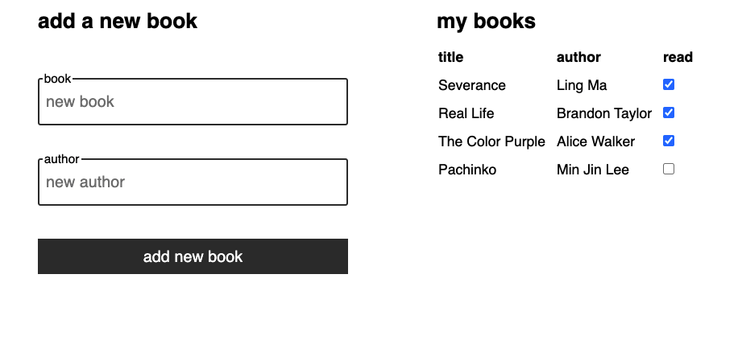

# Book List

A sample app from back to front. Keep a list of books you want to read and mark them off when you're finished with them. A demonstration application built with React and Express.



## Installation and Running

1. Clone repository
2. Navigate to `book-app` directory

```sh
cd book-app
```

3. Install frontend and backend dependencies
```sh
cd frontend && yarn # npm install
cd ../backend && yarn
```

4. Start the server
```sh
# ./book-app/backend
yarn start
```

5. Start React application
```sh
# ./book-app/frontend
yarn start
```

## Using the App
Navigate to http://localhost:3000 and add books to the list of books by using the form. Both author and title have to be filled out in order to submit a new book. Once you add a book, a request is sent to the backend and the book is added to the `booksDB`. Also check off books as you finish them. Similarly, data are sent back to server and saved to `booksDB` so that it persists as long as the server is running.

This is a sample app to demonstrate http requests with `React` and `Express` to send data from back to front to back again.

## Testing http server

Check to see if if get route return `booksDB`
```sh
curl -X GET http://localhost:8000/books
[{"id":1,"title":"Severance","author":"Ling Ma","read":false},{"id":2,"title":"Real Life","author":"Brandon Taylor","read":false},{"id":3,"title":"The Color Purple","author":"Alice Walker","read":false}]
```

Attempt to to post a new book and see if `booksDB` has been updated
```sh
curl --header "Content-Type: application/json" \
  -X POST \
  -d '{"title":"Ducks, Newburyport","author":"Lucy Ellman", "id":4, "read": false}'  http://localhost:8000/addbook

curl http://localhost:8000/books                [{"id":1,"title":"Severance","author":"Ling Ma","read":false},{"id":2,"title":"Real Life","author":"Brandon Taylor","read":false},{"id":3,"title":"The Color Purple","author":"Alice Walker","read":false},{"title":"Ducks, Newburyport","author":"Lucy Ellman","id":4,"read":false}]
```


